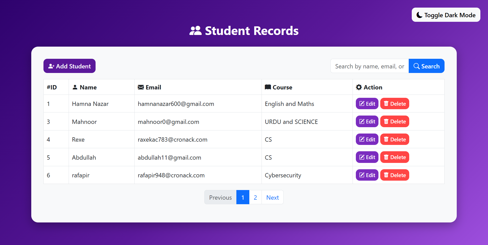
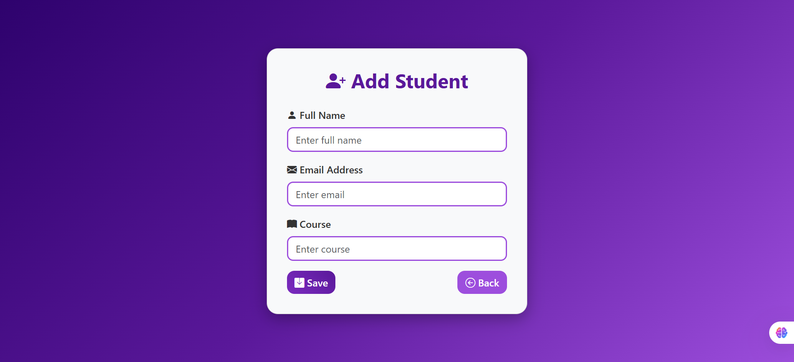
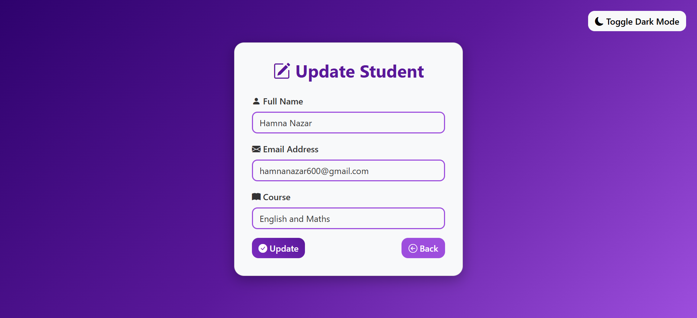
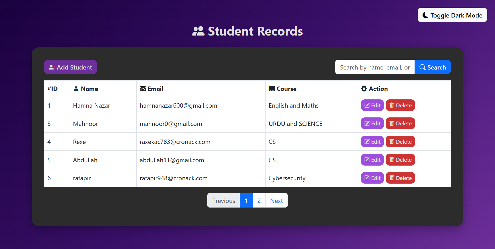

# 🎓 Student Management System (PHP + MySQL)

A simple **CRUD application** built with **PHP, MySQL, and Bootstrap**.  
This project demonstrates how to create, read, update, and delete student records from a database.

---

## 📌 Features
- **Create:** Add new student records with Name, Email, and Course.
- **Read:** View all students in a table.
- **Update:** Edit existing student details.
- **Delete:** Remove student records with confirmation.
- **Pagination:** Student records are displayed with **5 rows per page**.
- **Search Bar:** Quickly find students by name, email, or course.
- **Dark Theme Toggler:** Switch between light and dark modes for better usability.
- **Bootstrap Styling:** Modern, responsive design with gradient theme.

---

## 📂 Project Structure
```text
STUDENT_MANAGEMENT_SYSTEM/
│── db.php # Database connection
│── create.php # Form to add student
│── insert.php # Logic to insert student data
│── read.php # Display student records 
│── update.php # Form to edit student
│── update-process.php # Logic to update student
│── delete.php # Logic to delete student
│── style.css  # Styling of pages
├── script.js  # Dark theme toggler query
│── images/               # Screenshots for preview
│   ├──student_record.png
│   ├──add_student_record.png
│   ├──update_record.png
│   ├──dark_theme.png
│   ├──WORKING.mp4
│── sql/
│   ├──students.sql     # Exported database file
```


---

## 🛠️ Setup Instructions

### 1️⃣ Import the Database

1- Open phpMyAdmin (from XAMPP or WAMP).

2- Create a database named student_db.

3- Import the SQL file located at:
```
sql/students.sql
```
### 2️⃣ Configure Database Connection

1- Update your db.php file if needed:

```
<?php
$servername = "localhost";
$username   = "root";
$password   = "";
$database   = "student_db";

$conn = new mysqli($servername, $username, $password, $database);

if ($conn->connect_error) {
    die("Connection failed: " . $conn->connect_error);
}
?>
```
### 3️⃣ Run the Project

1-Place the STUDENT_MANAGEMENT_SYSTEM folder inside htdocs/ (if using XAMPP) or www/ (if using WAMP)

2-Start Apache and MySQL services.

3-Open in browser:
http://localhost/student_management_system/read.php

---

## 🎨 UI Preview

1- Student Record
  
2-Add Student Record
  
3-Update Student Record
  
4-Dark Theme Toggler
  

---

## 👨‍💻 Author

HAMNA NAZAR

---